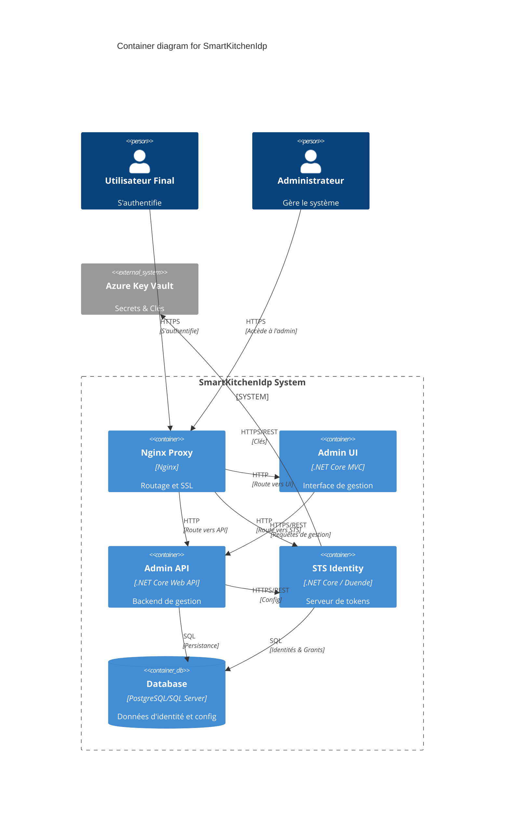

# Containers: SmartKitchenIdp

> Part of: [Architecture Index](index.md)
> C4 Level 2 — deployable units that compose the system.
> For internal components, see each container's folder.

## Status
Draft

---

## Containers

### Admin UI
- Type: Web App (SPA/MVC)
- Responsibility: Fournir l'interface utilisateur pour la gestion du système d'identité.
- Technology: .NET Core MVC / Razor Pages.
- Exposes: Interface utilisateur via HTTPS.
- Consumes: Admin API.
- Components detail: [containers/admin-ui/component.md](containers/admin-ui/component.md)

### Admin API
- Type: API
- Responsibility: Exposer les endpoints de gestion pour l'UI Admin et gérer la persistance des configurations.
- Technology: .NET Core Web API.
- Exposes: REST API (JSON).
- Consumes: Database, STS Identity.
- Components detail: [containers/admin-api/component.md](containers/admin-api/component.md)

### STS Identity
- Type: API / Security Token Service
- Responsibility: Gérer l'authentification, l'émission de jetons (OIDC/OAuth2) et la gestion des sessions.
- Technology: .NET Core / Duende IdentityServer.
- Exposes: Endpoints OIDC/OAuth2 (Discovery, Token, UserInfo, etc.).
- Consumes: Database, Azure Key Vault.
- Components detail: [containers/sts-identity/component.md](containers/sts-identity/component.md)

### Database
- Type: Database
- Responsibility: Stocker les identités, les configurations des clients, les grants et les logs d'audit.
- Technology: PostgreSQL / SQL Server.
- Exposes: SQL Port.
- Consumes: (Néant).
- Components detail: N/A

### Nginx Proxy
- Type: Reverse Proxy
- Responsibility: Router le trafic entrant vers les différents conteneurs et gérer le SSL.
- Technology: Nginx.
- Exposes: Ports 80/443.
- Consumes: Admin UI, Admin API, STS Identity.
- Components detail: N/A

---

## Interactions

- **Utilisateur** $\rightarrow$ **Nginx Proxy**: HTTPS — Accès au système.
- **Nginx Proxy** $\rightarrow$ **Admin UI**: HTTP — Routage vers l'interface admin.
- **Nginx Proxy** $\rightarrow$ **Admin API**: HTTP — Routage vers l'API admin.
- **Nginx Proxy** $\rightarrow$ **STS Identity**: HTTP — Routage vers le serveur de tokens.
- **Admin UI** $\rightarrow$ **Admin API**: HTTPS/REST — Requêtes de gestion.
- **Admin API** $\rightarrow$ **Database**: SQL — Persistance des données.
- **Admin API** $\rightarrow$ **STS Identity**: HTTPS/REST — Synchronisation de la configuration.
- **STS Identity** $\rightarrow$ **Database**: SQL — Lecture/Écriture des identités et grants.
- **STS Identity** $\rightarrow$ **Azure Key Vault**: HTTPS/REST — Récupération des clés de chiffrement.

---

## Diagram

---

## Risks

- <RISK-01>: **Dépendance critique au STS**.
  - Likelihood: Low
  - Impact: High (Toute l'écosystème est bloqué si le STS tombe).
  - Mitigation: Mise en place d'un cluster STS avec base de données répliquée.

---

## Open Questions

- <OQ-37>: Le Nginx Proxy gère-t-il la terminaison SSL ou est-ce fait au niveau des conteneurs ? ❓

---

## Links

→ [Context](context.md)
→ [Cross-Cutting](cross-cutting.md)
→ [Index](index.md)