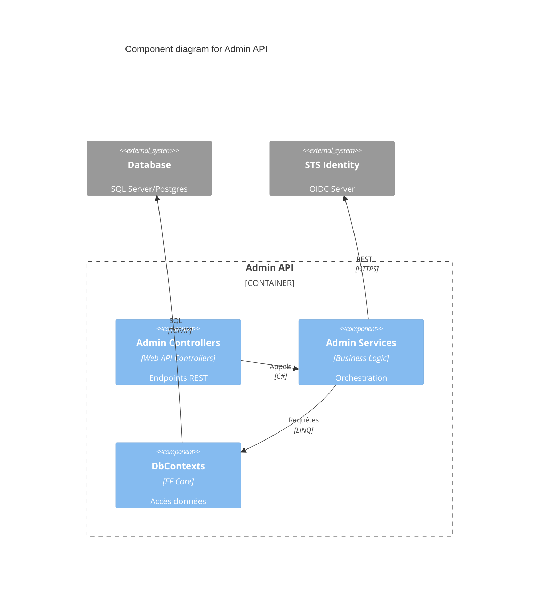

# Components: Admin API

> Part of: [Containers](../../containers.md) | [Architecture Index](../../index.md)
> C4 Level 3 — internal components of this container.

## Status
Draft

---

## Description

L'Admin API est le moteur de gestion du système. Elle expose les fonctionnalités de configuration et assure la liaison entre l'UI et la persistance.

- Responsabilité: Validation métier des configurations et orchestration des mises à jour.
- Préoccupations internes: Sécurisation des endpoints, Mapping DTO/Entity, Gestion des transactions.

---

## Components

### Admin Controllers
- Type: Controller
- Responsibility: Exposer les endpoints REST pour la gestion.
- Inputs: JSON / HTTP Requests.
- Outputs: JSON / HTTP Responses.
- Dependencies:
  - Admin Services

### Admin Services
- Type: Service
- Responsibility: Implémenter la logique métier de l'administration.
- Inputs: DTOs.
- Outputs: Résultats d'opérations.
- Dependencies:
  - DbContexts
  - STS Identity (→ [containers.md](../../containers.md))

### DbContexts (Admin)
- Type: Repository / ORM
- Responsibility: Gérer l'accès aux tables de configuration et d'audit.
- Inputs: Requêtes LINQ.
- Outputs: Entités EF Core.
- Dependencies:
  - Database (→ [containers.md](../../containers.md))

---

## Interactions

- **Admin Controllers** $\rightarrow$ **Admin Services**: Appels de méthodes — Traitement métier.
- **Admin Services** $\rightarrow$ **DbContexts**: LINQ — Persistance.
- **Admin Services** $\rightarrow$ **STS Identity**: HTTPS/REST — Synchronisation des configurations.

---

## Diagram

---

## Open Questions

- <OQ-39>: L'API utilise-t-elle un pattern CQRS ou un service classique ? ❓

---

## Links

→ [Container overview](../../containers.md)
→ [Index](../../index.md)