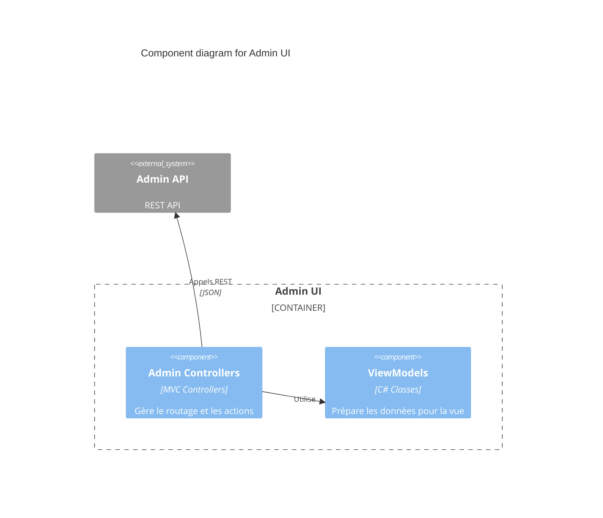

# Components: Admin UI

> Part of: [Containers](../../containers.md) | [Architecture Index](../../index.md)
> C4 Level 3 — internal components of this container.

## Status
Draft

---

## Description

L'Admin UI est l'interface de gestion du système. Elle permet aux administrateurs de configurer les clients, les utilisateurs et les rôles sans interaction directe avec l'API.

- Responsabilité: Présentation des données de configuration et capture des modifications.
- Préoccupations internes: Routage MVC, Validation de formulaire, Gestion de session admin.

---

## Components

### Admin Controllers
- Type: Controller
- Responsibility: Gérer les requêtes HTTP et orchestrer la vue.
- Inputs: Requêtes utilisateur.
- Outputs: Vues Razor.
- Dependencies:
  - Admin API (→ [containers.md](../../containers.md))

### ViewModels
- Type: Data Transfer Object
- Responsibility: Structurer les données pour l'affichage dans les vues.
- Inputs: Données de l'API.
- Outputs: Données liées aux vues.
- Dependencies: (Néant)

---

## Interactions

- **Admin Controllers** $\rightarrow$ **Admin API**: HTTPS/REST — Récupération et mise à jour des configurations.

---

## Diagram

---

## Open Questions

- <OQ-38>: L'UI utilise-t-elle du JavaScript côté client pour certaines interactions complexes ? ❓

---

## Links

→ [Container overview](../../containers.md)
→ [Index](../../index.md)