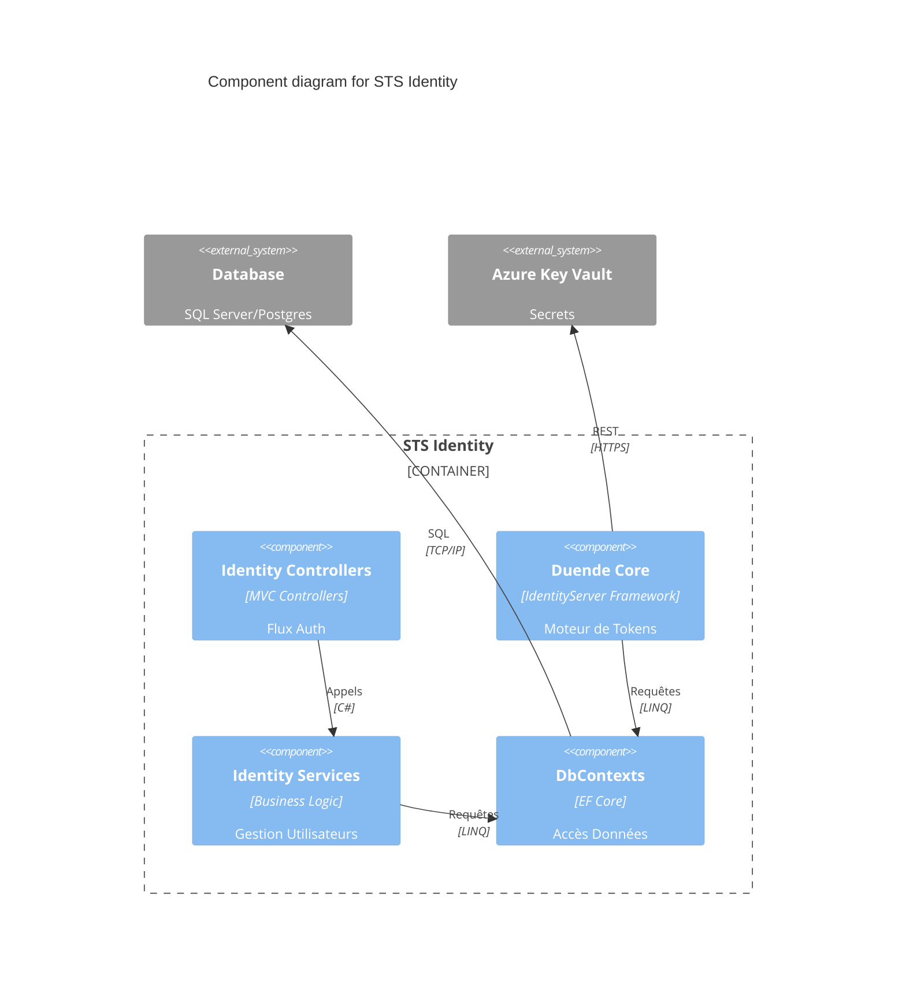

# Components: STS Identity

> Part of: [Containers](../../containers.md) | [Architecture Index](../../index.md)
> C4 Level 3 — internal components of this container.

## Status
Draft

---

## Description

Le STS Identity est le cœur sécuritaire du système. Il implémente le serveur de tokens et gère l'authentification des utilisateurs.

- Responsabilité: Émission de jetons, validation d'identité, gestion du consentement.
- Préoccupations internes: Cryptographie, Gestion des sessions, Conformité OIDC/OAuth2.

---

## Components

### Identity Controllers
- Type: Controller
- Responsibility: Gérer les flux d'authentification (Login, Consent, Logout).
- Inputs: Requêtes HTTP.
- Outputs: Vues Razor / Redirections.
- Dependencies:
  - Identity Services

### Duende IdentityServer Core
- Type: Framework / Engine
 la Responsibility: Gérer la logique complexe d'émission de tokens et la validation des requêtes.
- Inputs: Requêtes OIDC.
- Outputs: Tokens (JWT).
- Dependencies:
  - DbContexts (Configuration, Grants)

### Identity Services
- Type: Service
- Responsibility: Gérer les utilisateurs, les rôles et les Passkeys.
- Inputs: Commandes métier.
- Outputs: Résultats d'opérations.
- Dependencies:
  - DbContexts (Identity)

### DbContexts (STS)
- Type: Repository / ORM
- Responsibility: Gérer la persistance des identités et des grants.
- Inputs: Requêtes LINQ.
- Outputs: Entités EF Core.
- Dependencies:
  - Database (→ [containers.md](../../containers.md))

---

## Interactions

- **Identity Controllers** $\rightarrow$ **Identity Services**: Appels de méthodes — Gestion utilisateur.
- **Duende Core** $\rightarrow$ **DbContexts**: LINQ — Lecture config et grants.
- **Identity Services** $\rightarrow$ **DbContexts**: LINQ — Gestion identités.
- **STS Identity** $\rightarrow$ **Azure Key Vault**: REST — Récupération des clés de signature.

---

## Diagram

---

## Open Questions

- <OQ-40>: Le système utilise-t-il un cache distribué (Redis) pour les sessions ? ❓

---

## Links

→ [Container overview](../../containers.md)
→ [Index](../../index.md)