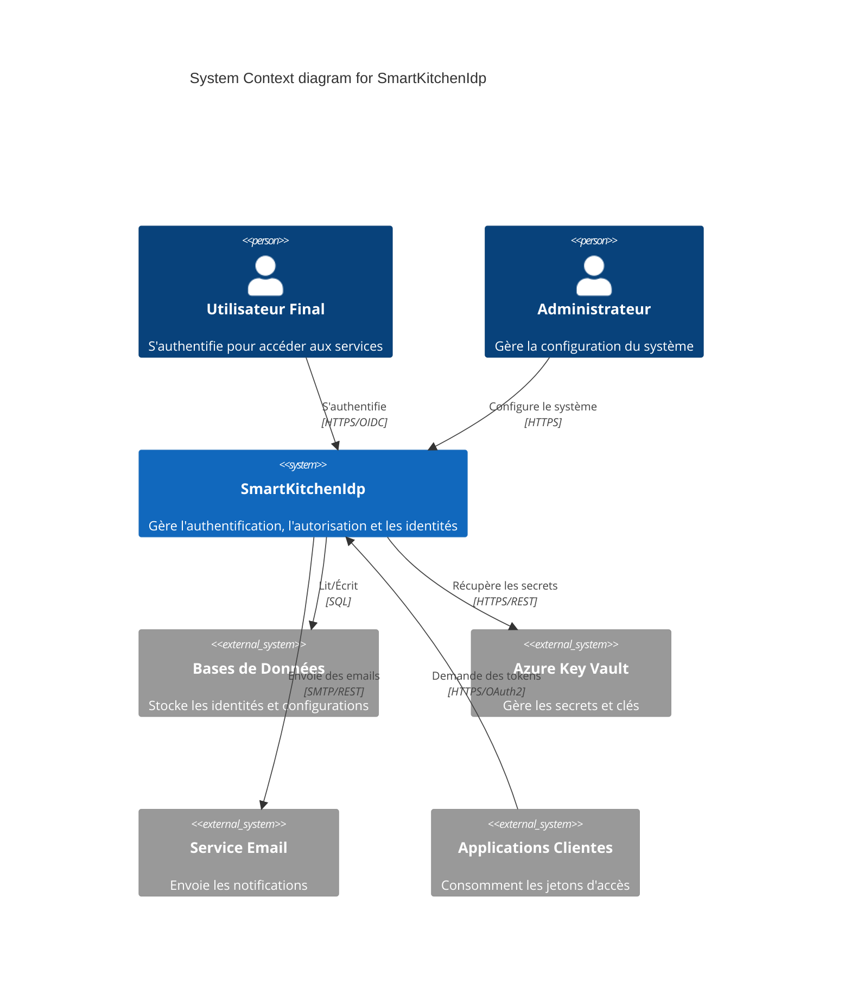

# Context: SmartKitchenIdp

> Part of: [Architecture Index](index.md)
> C4 Level 1 — describes the system in its environment.

## Status
Draft

---

## Description

SmartKitchenIdp est un fournisseur d'identité (Identity Provider - IdP) centralisé. Il permet de gérer l'authentification et l'autorisation des utilisateurs et des applications au sein de l'écosystème SmartKitchen, en utilisant les protocoles standards OpenID Connect et OAuth 2.0.

- **Problème résolu** : Centralisation de la gestion des identités et des accès (IAM) pour éviter la duplication des comptes et sécuriser les échanges entre services.
- **Utilisateurs** : Utilisateurs finaux et Administrateurs système.
- **Environnement de déploiement** : Conteneurisé via Docker, orchestré avec Nginx comme reverse proxy.

---

## Actors

- **Utilisateur Final**:
  - Role: Consommateur des services de l'écosystème.
  - How they interact: S'authentifie via le STS pour accéder aux applications clientes.
- **Administrateur**:
  - Role: Gestionnaire du système d'identité.
  - How they interact: Configure les clients, les rôles et les utilisateurs via l'interface d'administration.

---

## External Systems

- **Bases de Données (PostgreSQL / SQL Server)**:
  - Purpose of the interaction: Persistance des configurations, des identités et des logs d'audit.
  - Protocol / integration type: ADO.NET / Entity Framework Core.
  - Direction: both
- **Azure Key Vault**:
  - Purpose of the interaction: Stockage sécurisé des secrets et clés de chiffrement.
  - Protocol / integration type: Azure SDK / REST API.
  - Direction: outbound
- **SendGrid / SMTP**:
  - Purpose of the interaction: Envoi d'emails de confirmation et de récupération de compte.
  - Protocol / integration type a: SMTP / REST API.
  - Direction: outbound
- **Applications Clientes**:
  - Purpose of the interaction: Demande de jetons d'accès et validation d'identité.
  - Protocol / integration type: HTTPS / OIDC / OAuth2.
  - Direction: both

---

## Diagram

---

## Constraints

- <CON-01>: Le système doit être compatible avec les standards stricts d'OpenID Connect pour permettre l'interopérabilité avec des clients tiers.

---

## Assumptions

- <ASM-01>: L'infrastructure réseau permet la communication sécurisée (HTTPS) entre le STS et les applications clientes.
  - Consequence if wrong: Le système serait vulnérable aux attaques de type Man-in-the-Middle.

---

## Open Questions

- <OQ-36>: Le système doit-il supporter d'autres fournisseurs d'identité externes (SAML, etc.) à l'avenir ? ❓

---

## Links

→ [Containers](containers.md)
→ [Cross-Cutting](cross-cutting.md)
→ [Index](index.md)